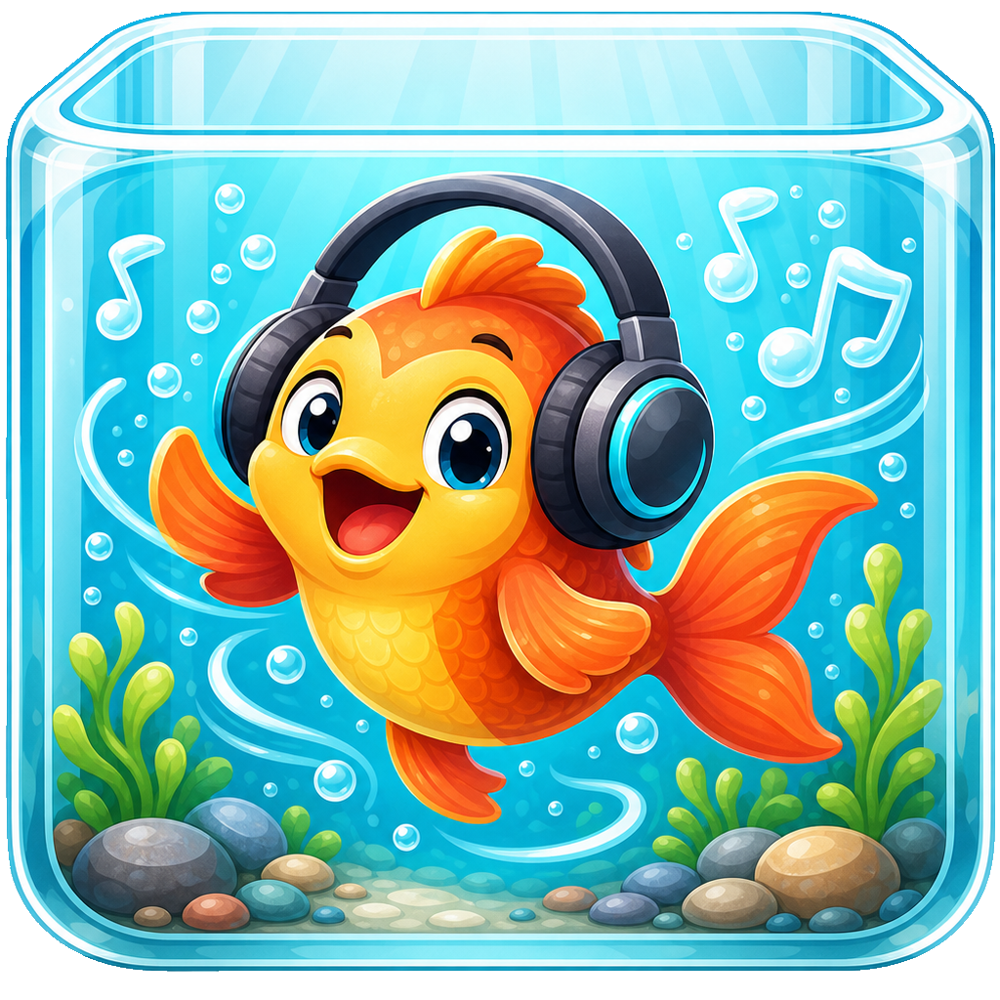

# AquaSynth

<p align="center">
  
</p>

C# patch authoring, analysis, and Faust toolchain for AquaSynth. It parses the
`.aqua` DSL into a serializable patch graph, emits Faust `.dsp`, and owns the
path from patch intent to generated DSP artifacts.

This repo is the C# bridge for AquaSynth/Vortice-land. Rust remains the reference
lab; this project is the tool that lets the engine script Faust without dragging
the AquaSynth-rs crate into the room by the ankle.

## Run

```powershell
dotnet test
```

DX7 reference-render tests use `dexed-py` when a Python with `dexed` and
`numpy` is available. Set `AQUASYNTH_DX7_PYTHON` to that interpreter to force a
specific runtime; otherwise the tests skip the render path and still parse the
vendored public-domain fixture.

ZynAddSubFX is pinned as a GPL test/development reference under
`external/zynaddsubfx`. Initialize it with:

```powershell
git submodule update --init --recursive
```

That source is a parity oracle only. AquaSynth does not ship Zyn code, link it
from published packages, or treat it as runtime machinery.

## Package Boundary

Downstream consumers should pin the NuGet packages from this repo, not use live
project references. Breaking synth-library work should happen here freely, then
consumers should intentionally update only after new package versions are packed
and tested.

```powershell
dotnet pack src\AquaSynth.Core\AquaSynth.Core.csproj -c Release
dotnet pack src\AquaSynth.Faust\AquaSynth.Faust.csproj -c Release
```

`AquaSynth.Core` owns patch meaning: model records, the `.aqua` parser,
authoring helpers, analysis/scoring tools, presets, and Faust source emission.
`AquaSynth.Faust` depends on Core and owns toolchain/rendering work: Faust CLI
validation, target-code generation, live patch compilation, native `libfaust`
loading, compile manifests, DSP factory lifetime, and offline/sample rendering.

The test suite verifies that development fixtures, Python render helpers,
external reference synth sources, and SysEx banks do not ship in
published packages.

## Shape

- `PatchScript.Parse(script)` lowers terse script into `SynthPatch`.
- `FaustEmitter.Emit(patch)` emits Faust source.
- `FaustCompiler.ValidateAsync(source)` compile-checks with Faust when present
  from `AquaSynth.Faust`.
- `FaustCompiler.CompileAsync(source, options)` writes generated backend code
  through an installed or resolved Faust compiler from `AquaSynth.Faust`.
- `AquaSynthPatchCompiler` from `AquaSynth.Faust` is the live host-facing
  boundary for compiling `.aqua` scripts into hosted DSP factories.
- `AquaSynthNativeCompiler` remains the lower native `libfaust` compiler
  machinery behind that boundary.
- `BuiltInScripts.ReferenceScripts()` carries readable SFXR, BFXR-flavored,
  808, FM bell, wobble bass, and advanced layered patches. They are stable
  references for testing and for judging whether the DSL can express useful
  sound designs cleanly.
- `SfxrParams`, `PatchScriptScoring`, `AudioAnalyzer`, and `Presets` carry the
  reusable AquaSynth-rs-side analysis, scoring, SFXR, and preset tools.

The authoring/test lane can compile Faust-generated C# for easy .NET rendering
and parity checks:

```csharp
var patch = PatchScript.Parse("""
    voice
        wave=saw
        freq=55
        gain=0.2
        sustain=0.5
        decay=0.2
    """);
var export = FaustEmitter.Emit(patch, new FaustExportOptions("bass"));
await FaustCompiler.CompileAsync(
    export.Source,
    new FaustCompileOptions(FaustTargetLanguage.CSharp, "Generated/Bass.cs"));
```

The runtime lane is different. AquaSynth should own Faust toolchain selection,
compile cache identity, generated artifacts, parameter manifests, and dynamic
patch compilation outside the realtime path. Aquarium Engine should load and
host the finished artifact, bind controls, and schedule audio. Native Faust
targets are the preferred shipping path when the platform allows them; C# output
is convenient authoring machinery, not the ceiling.

`AquaSynthPatchCompiler` is the live runtime-facing version of that boundary: it
owns native `libfaust` loading policy, script parsing, Faust emission, compile
keys, DSP source artifacts, manifests, and compiled products. Engine callers
keep their device and scheduling code, and ask AquaSynth for compiled/renderable
synth products.

See [`docs/faust-toolchain-boundary.md`](docs/faust-toolchain-boundary.md).

## Status

The current slice covers the modular graph surface needed by the reference
scripts, SFXR atoms, script scoring, audio comparison, presets, Faust emission,
native Faust compilation/rendering, and installed Faust validation. Migration
coverage is tracked in
[`docs/migration-checklist.md`](docs/migration-checklist.md), because leaving
important things behind in the old repo would be a very efficient way to become
our own haunted house.

Reference-driven DSL growth is tracked in
[`docs/reference-synth-roadmap.md`](docs/reference-synth-roadmap.md). Agent
handoff state lives in [`state/spine.yaml`](state/spine.yaml).
